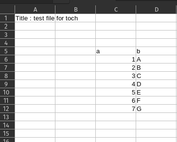
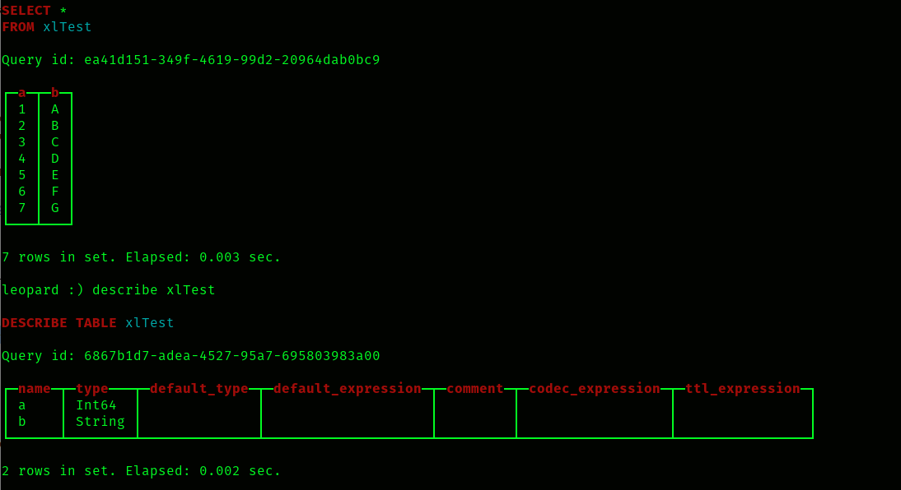

### toch command
toch moves data from files and the web into ClickHouse.

Features of toch include:

  - Muliple data formats are supported:
       - tab delimited
       - CSV
       - Excel: XLS (linux only) and XLSX formats
  - Data sets can have headers or not
  - Field names can be user-supplied or changed from the data header
  - Field types can be imputed or supplied
  - The Excel sheet name and a cell range can be supplied

Required command line arguments:
  
    -s          source of data. This is either a file or web address.
    -type       type of data.  The options are:
        text    tab delimited
        csv     comma separated
        xls     Excel XLS
        xlsx    Excel XLSX
    -table      destination ClickHouse table.

Optional command line arguments:

    -host           IP of ClickHouse database.                Default: 127.0.0.1
    -user           ClickHouse user.                          Default: "default"
    -password       ClickHouse password.                      Default: "" (empty)
    -c [Y/N]        convert field names to camel case.        Default N
    -q <char>       character for delimiting text.            Default: " (double quote)
    -h 'f1,f2,...'  the field names are comma separated and the entire list is enclosed in single quotes. 
                    The default is to read these from the data.
    -t 't1,t2,...'  the types are comma separated and the entire list is encludes in single quotes. 
                    The default is to infer these from the data. 
                    The types supported are:
                        f   Float64
                        i   Int64
                        d   Date
                        s   String

    -dateFormat     format for dates using Jan 2, 2006 as the prototype, e.g. 1/2/2006 or 20060102

     -sheet          sheet name for Excel inputs.  Default: first sheet in the workbook.
     -rows <S:E>     start row:end row range from which to pull data from Excel inputs. 
                     If E=0, all rows after S are taken. Default: 0:0
     -cols <S:E>     start column:end column range from which to pull data from Excel inputs. 
                     If E=0, all columns after S are taken. Default 0:0
Notes:
  - if -h is supplied, the list must include all fields.
  - if -t is supplied, the list must included all fields.
  - The options -h and -t are independent: one can be supplied without the other.
  - ctrl-R's in the data are ignored.
  - S and E are 0-based indices.
  - The -skip parameter works with spreadsheets, too. It is applied within (any possible) range supplied by -rows.

Values that are illegal for the field type are filled in as:
   - Float64: the maximum value for Float64 (~E308)
   - Int64: the maximum value for Int64 (9223372036854775807)
   - Date: 1970/1/1
   - String: "!"

### Examples

The command

    toch   -table laSeries -type text -s https://download.bls.gov/pub/time.series/la/la.series
loads the la.series table from the Bureau of Labor Statistics into ClickHouse table laSeries.

And this command

      toch  -table test -type text -s https://download.bls.gov/pub/time.series/la/la.series -h 'a,b,c,d,e,f,g,h,i,j,k,l' -skip 1
loads the same table as above, but overrides the field names in the table with 'a' through 'l'.
The -skip 1 argument is used so that the header row will not be read as a part of the data.

The data in this csv from the FHFA has no header row.

      toch  -table msa -type csv -s https://www.fhfa.gov/DataTools/Downloads/Documents/HPI/HPI_AT_metro.csv -h 'name,msa,year, qtr, ind, delta' -t 's,s,i,i,f,s'
The -h option supplies the headers. The imputation wants to make the "msa" field an integer since
all the values are digits.  The -t option is used to override that to make the field a string.

Suppose we have a spreadsheet names test.xlsx that looks like this:

The command below will create the ClickHouse table xlTest and populate it with this sheet.
The sheet (the first tab in the workbook) is read starting at row 4 (Excel calls this row 5) and column C (that is,
column 2).

      toch -table xlTest -type XLSX -s test.xlsx -rows 4:0 -cols 2:0

The table created is below:

This command reads the same data, but specifies the field types to both be strings and the field names to be 'x' and 'y':

       toch -table XlTest -type XLSX -s test.xlsx -rows 5:0 -cols 2:0 -h 'x,y' -t 's,s'

Since the header row in the spreadsheet is not used, the starting row is one larger.  We could have also
kept "-rows 4:0" and added "-skip 1".
